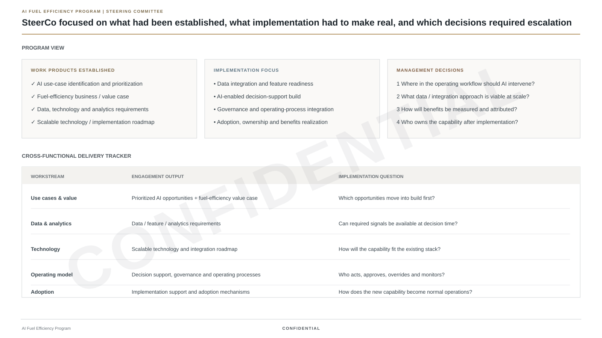

# Neeraj Monga — AI Strategy & Transformation

**Strategy, AI and transformation — shaped by curiosity about how people, systems and places work.**

I am a strategy and transformation leader with **15+ years of experience** advising governments, sovereign investors and C-suite executives across aviation, infrastructure, telecom, industrials and consumer sectors.

My career has evolved from strategy consulting into large-scale transformation, innovation and AI-enabled execution. I have spent **9 years in strategy consulting**, including roles at **Strategy&, Bain & Company and Kearney**, and I currently work on transformation initiatives in Abu Dhabi.

My focus is not AI as a standalone technology. It is the point where **AI, economics, operating models and implementation meet**.

Outside the formal CV, **culture and travel are a major part of my life**. I have lived in **7 countries** and travelled to **92 countries**. That experience has made me deeply curious about how people experience a place — its culture, infrastructure, services and everyday details.

> This portfolio combines real professional experience with technical reconstructions and independent AI labs. **Actual client data, production results and internal implementation materials are confidential and are not shown.** Portfolio figures and visuals are reconstructed to demonstrate the methodology, architecture and implementation approach.

---

## Professional profile

| Experience | Evidence |
|---|---|
| **15+ years** | Strategy, transformation and operations |
| **9 years** | Strategy consulting |
| **Strategy& · Bain · Kearney** | Top-tier consulting experience |
| **GCC leadership** | Abu Dhabi, Dubai and Saudi engagements |
| **AI transformation** | Aviation AI initiative from opportunity identification through implementation |
| **US$20B transaction** | Integration Management Office experience |
| **1,200+ locations** | Cross-functional telecom integration scope |
| **9 initiatives** | Strategic portfolio mobilization for a major utility |
| **3 promotions in 3 years** | Kearney career progression |

---

# Selected Work

## A major airline — AI transformation

Supported an **AI initiative for a major airline** focused on operational and fuel-efficiency priorities.

My role included:
- identifying and prioritizing AI use cases
- translating operational opportunities into data, technology, analytics and organizational requirements
- developing business and value cases for priority AI-enabled opportunities
- defining a scalable technology and implementation roadmap
- shaping AI-enabled decision support, governance, operating processes and adoption
- supporting implementation

This is the anchor for the flagship case study in this portfolio.

## Sovereign Portfolio Transformation

As an Associate Director in Abu Dhabi, I support transformation and restructuring programs across portfolio companies, including strategic initiative mobilization, cross-functional PMO and enterprise change.

## GCC Government Strategy

At Strategy&, I led operating-model redesign and national-sector transformation engagements for government entities in Saudi Arabia.

## Large-Scale Integration

Helped establish an Integration Management Office for a **US$20B telecom transaction**, coordinating a 54-person consulting / operations team and integration across more than **1,200 retail locations**.

## Innovation & Emerging Technology

At Robert Bosch, I worked across business and digital transformation and helped pioneer a blockchain team, including thought leadership on blockchain-enabled agricultural ecosystems.

---

# AI & Technical Portfolio

The work below is split deliberately into two categories:

### Experience-based case study
A validated technical reconstruction of a real AI transformation I advised on and helped implement. Everything that runs was built independently; the engagement, my role and the delivery approach are real.

### Independent technical notes
Compact design notes on AI architecture, evaluation and governance, each with a small runnable reference. They are not presented as client work, and they are not presented as more than they are.

---

## 00 — Airline AI Value & Operations Platform

**Flagship experience-based case study** · [](https://github.com/monganeeraj1/ai-strategy-transformation/actions/workflows/aviation-ai-ci.yml)

How do you move from an operational AI opportunity to a model, a decision-support workflow, an implementation program and measurable value — and how do you know each step is working?

Client data is confidential, so the prototype runs on a **disclosed simulator with known ground truth**. That is a deliberate choice, not a compromise: it makes the method testable in ways real data would not allow offline.

What the pipeline does, and what the 42 tests check:

| Step | Implementation | Validated against |
|---|---|---|
| Model | Gradient boosting, **temporal** split, mean and ridge baselines | The simulator's noise floor — the model closes 84% of the gap between linear and ceiling |
| Uncertainty | p10/p90 quantile models + **split-conformal** calibration | Coverage on the later window: 71% raw → 80% calibrated (nominal 80%) |
| Attribution | Counterfactual controllable excess, **exact Shapley** by lever | Ground truth: r = 0.97, dominant lever right 85%, bias −3 pp and explained |
| Decision layer | Abstain → filter → rank on controllable kg → explain | Oracle, naive-total and random policies on the same review capacity |
| Monitoring | PSI on features and predictions, residual z-test, season-matched reference | Two injected drift scenarios with distinct signatures |
| Value | Annual range with adoption and realisation explicit | One row informed by the actual queue |

```bash
cd projects/00_aviation_ai_value_platform && python -m pytest && python -m fuelops
```

### Implementation view



*The engagement is real. Actual client data and the airline's internal materials are confidential; this view recreates the implementation work without reproducing client content.*


*The roadmap reflects the implementation workstreams I worked across; client-specific dates, owners and internal materials are omitted.*

### Deep dive

- [Inside the airline AI engagement — work-sample walkthrough](docs/cases/inside-the-airline-engagement.html)
- [Project README — design decisions a reviewer should challenge](projects/00_aviation_ai_value_platform/)
- [Results — every number the pipeline produces](projects/00_aviation_ai_value_platform/RESULTS.md)
- [Model Card](projects/00_aviation_ai_value_platform/MODEL_CARD.md)
- [Failure Analysis](projects/00_aviation_ai_value_platform/FAILURE_ANALYSIS.md)
- [Architecture Deep Dive](projects/00_aviation_ai_value_platform/ARCHITECTURE_DEEP_DIVE.md)
- [AI Investment & Value Model](projects/00_aviation_ai_value_platform/VALUE_MODEL.md)
- [Implementation Playbook](projects/00_aviation_ai_value_platform/IMPLEMENTATION_PLAYBOOK.md)
- [Code: `fuelops/`](projects/00_aviation_ai_value_platform/fuelops/) · [Tests: `tests/`](projects/00_aviation_ai_value_platform/tests/)

---

## 01 — RAG Evaluation

**Design notes + minimal reference**

Why a RAG system fails even when the model is strong, and how to evaluate retrieval separately from generation.

- *Notes cover:* Recall@K and MRR, lexical vs dense vs hybrid retrieval, chunking and reranking, groundedness and citation checks, abstention, adversarial and multilingual stress tests, latency and cost.
- *Reference code:* a dependency-free TF-IDF retriever over a small visitor-information corpus with Recall@K and MRR — enough to show the metric mechanics, no more.

[Open →](projects/01_rag_evaluation_lab/)

---

## 02 — Predictive Operations AI

**Single-file entry point**

The prediction-to-prioritisation chain in ~100 lines: synthetic operations data, gradient boosting, permutation importance, top-decile capture. It is the compact version of the argument that project 00 makes in full — read this first if you want the shape, read 00 if you want the validation.

[Open →](projects/02_predictive_operations_ai/)

---

## 03 — Agentic AI Control Plane

**Design notes + minimal reference**

How an enterprise should govern an AI system that can select tools and take actions.

- *Notes cover:* tool allowlists, least privilege, risk-tiered approval gates, structured schemas, idempotency, audit logging, timeout and rollback policy, prompt-injection defence, spend limits, and what to evaluate.
- *Reference code:* the risk-tier → policy → human-approval primitive as a runnable stub, with an audit record per request. Routing is keyword-based on purpose; the control logic is the point.

[Open →](projects/03_agentic_ai_control_plane/)

---

## 04 — AI Transformation Operating Model

**Operating-model framework**

A reusable framework for moving AI initiatives from opportunity discovery to scaled ownership: use-case prioritisation, technical and value theses, pilot design, stage gates, model-risk review, governance, benefits realisation, transition to permanent ownership.

[Open →](projects/04_ai_transformation_operating_model/)

---

# How I Approach AI

For each initiative, I separate six questions:

| Layer | Question |
|---|---|
| **Outcome** | What decision, behavior or operating outcome needs to improve? |
| **Data** | What signals exist, and are they reliable and available at decision time? |
| **Model** | Prediction, retrieval, generation, optimization or hybrid? |
| **Evaluation** | What does “good” mean offline, online and by operating segment? |
| **Workflow** | How does model output change a real process or decision? |
| **Governance** | What needs to be monitored, overridden, approved or stopped? |

A technically strong model can still fail if the workflow, intervention design, incentives, data pipeline or ownership model is weak.

---

# Career

### 2025–Present · Abu Dhabi
**Associate Director — Transformation & Restructuring work for ADQ via Contango**

AI-enabled aviation initiative, strategic initiative mobilization and enterprise transformation.

### 2023–2025 · Dubai / GCC
**Senior Engagement Manager / SME — Strategy&**

Government operating-model redesign and national utility-sector transformation.

### 2020–2023 · North America
**Engagement Manager — Asteri Partners**

Integration Management Office and wireless integration supporting a US$20B telecom transaction.

### 2018–2020 · North America
**Innovation & Advisory Lead — Robert Bosch**

Business and digital transformation; emerging-technology innovation.

### 2016–2018
**Engagement Manager — Bain & Company**

Strategy consulting across consumer industries.

### 2011–2016
**Consultant — Kearney**

Promoted three levels in three years with an “Exceeding All” rating each year.

---

# Education

**Executive MBA — IIM Calcutta**  
Exchange — MIT Sloan

**Computer Science Engineering — Panjab University**

---

## Disclosure

The aviation case is based on real professional experience. **Actual client data, production results, proprietary algorithms and internal implementation materials remain confidential and are not shown.** The code, data, model outputs, dashboards and implementation visuals in this portfolio are reconstructed to demonstrate the analytical and delivery approach.

The other technical labs are independent portfolio builds intended to demonstrate how I think about AI systems. They are not presented as client work.
