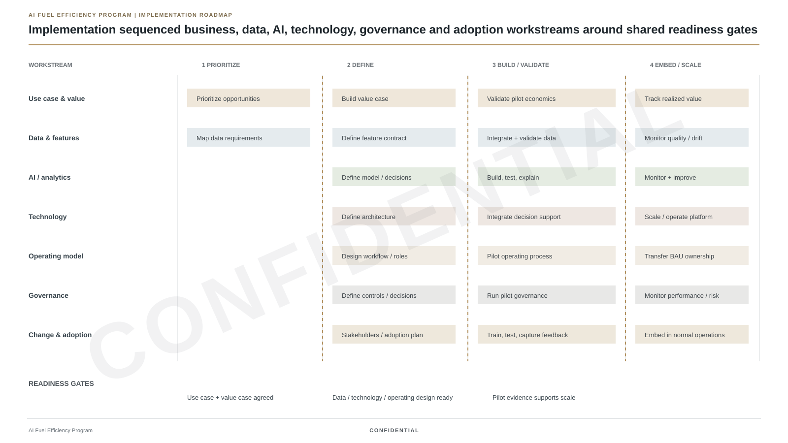
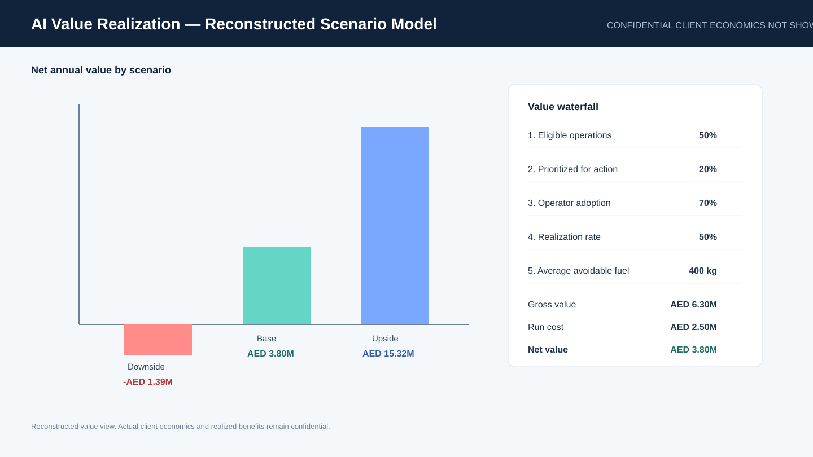

# Neeraj Monga — AI Strategy & Transformation

**Strategy, AI and transformation — shaped by curiosity about how people, systems and places work.**

I am a strategy and transformation leader with **15+ years of experience** advising governments, sovereign investors and C-suite executives across aviation, infrastructure, telecom, industrials and consumer sectors.

My career has evolved from strategy consulting into large-scale transformation, innovation and AI-enabled execution. I have spent **9 years in strategy consulting**, including roles at **Strategy&, Bain & Company and Kearney**, and I currently work on transformation initiatives in Abu Dhabi.

My focus is not AI as a standalone technology. It is the point where **AI, economics, operating models and implementation meet**.

Outside the formal CV, **culture and travel are a major part of my life**. I have lived in **7 countries** and travelled to **92 countries**. That experience has made me deeply curious about how people experience a place — its culture, infrastructure, services and everyday details.

> This portfolio combines real professional experience with technical reconstructions and independent AI labs. **Actual client data, production results and internal implementation materials are confidential and are not shown.** Portfolio figures and visuals are reconstructed to demonstrate the methodology, architecture and implementation approach.

---

## Professional profile

| Experience | Evidence |
|---|---|
| **15+ years** | Strategy, transformation and operations |
| **9 years** | Strategy consulting |
| **Strategy& · Bain · Kearney** | Top-tier consulting experience |
| **GCC leadership** | Abu Dhabi, Dubai and Saudi engagements |
| **AI transformation** | Aviation AI initiative from opportunity identification through implementation |
| **US$20B transaction** | Integration Management Office experience |
| **1,200+ locations** | Cross-functional telecom integration scope |
| **9 initiatives** | Strategic portfolio mobilization for a major utility |
| **3 promotions in 3 years** | Kearney career progression |

---

# Selected Work

## Etihad Airways — AI Transformation

Supported an **Etihad Airways AI initiative** focused on operational and fuel-efficiency priorities.

My role included:
- identifying and prioritizing AI use cases
- translating operational opportunities into data, technology, analytics and organizational requirements
- developing business and value cases for priority AI-enabled opportunities
- defining a scalable technology and implementation roadmap
- shaping AI-enabled decision support, governance, operating processes and adoption
- supporting implementation

This is the anchor for the flagship case study in this portfolio.

## Sovereign Portfolio Transformation

As an Associate Director in Abu Dhabi, I support transformation and restructuring programs across portfolio companies, including strategic initiative mobilization, cross-functional PMO and enterprise change.

## GCC Government Strategy

At Strategy&, I led operating-model redesign and national-sector transformation engagements for government entities in Saudi Arabia.

## Large-Scale Integration

Helped establish an Integration Management Office for a **US$20B telecom transaction**, coordinating a 54-person consulting / operations team and integration across more than **1,200 retail locations**.

## Innovation & Emerging Technology

At Robert Bosch, I worked across business and digital transformation and helped pioneer a blockchain team, including thought leadership on blockchain-enabled agricultural ecosystems.

---

# AI & Technical Portfolio

The work below is split deliberately into two categories:

### Experience-based case study
A technical reconstruction of a real AI transformation context I worked on.

### Independent technical labs
Compact builds used to explore AI architecture, evaluation, governance and operating implications. These are not presented as client engagements.

---

## 00 — Etihad Airways AI Value & Operations Platform

**Flagship experience-based case study**

How do you move from an operational AI opportunity to a model, decision-support workflow, implementation program and measurable value?

This case is based on **real professional engagement experience**. Actual client data and production outputs are confidential, so the technical implementation shown here has been reconstructed for portfolio demonstration.

It covers:
- AI problem formulation
- recreated flight-level data for the technical prototype
- feature engineering
- gradient-boosted regression
- model evaluation and explainability
- controllable vs contextual driver separation
- intervention prioritization
- human-in-the-loop decision support
- drift monitoring and MLOps
- implementation governance
- benefits realization and investment economics

### Implementation view

*The engagement is real. Actual client data and internal Etihad materials are confidential; this view recreates the implementation work without reproducing client content.*

*The roadmap reflects the implementation workstreams I worked across; client-specific dates, owners and internal materials are omitted.*

### Model & value view

*Actual client data and production results are confidential and are not shown; displayed metrics are reconstructed for portfolio demonstration.*

### Deep dive

- [Implementation Playbook](projects/00_aviation_ai_value_platform/IMPLEMENTATION_PLAYBOOK.md)
- [Case overview](projects/00_aviation_ai_value_platform/)
- [Model Card](projects/00_aviation_ai_value_platform/MODEL_CARD.md)
- [Failure Analysis](projects/00_aviation_ai_value_platform/FAILURE_ANALYSIS.md)
- [Architecture Deep Dive](projects/00_aviation_ai_value_platform/ARCHITECTURE_DEEP_DIVE.md)
- [AI Investment & Value Model](projects/00_aviation_ai_value_platform/VALUE_MODEL.md)
- [Reconstructed Benchmark Results](projects/00_aviation_ai_value_platform/RESULTS.md)
- [Runnable Python](projects/00_aviation_ai_value_platform/src/)

---

## 01 — RAG Evaluation Lab

**Independent technical lab**

A retrieval-first exploration of enterprise GenAI reliability.

Topics:
- Recall@K and MRR
- lexical vs dense retrieval
- chunking and reranking
- groundedness and citation quality
- abstention behavior
- hallucination controls
- multilingual / adversarial stress tests
- latency and cost trade-offs

[Open lab →](projects/01_rag_evaluation_lab/)

---

## 02 — Predictive Operations AI

**Independent technical lab**

A compact ML example focused on the transition from prediction to operational action.

Topics:
- feature engineering
- supervised ML
- train / test discipline
- gradient boosting
- MAE / RMSE / R²
- permutation importance
- top-k prioritization
- prediction vs causality
- controllable vs contextual variables

[Open lab →](projects/02_predictive_operations_ai/)

---

## 03 — Agentic AI Control Plane

**Independent technical lab**

An exploration of how tool-using AI systems should be controlled when they can take actions.

Topics:
- agent / tool architecture
- routing
- permission boundaries
- human approval gates
- least privilege
- audit logging
- failure handling
- prompt-injection considerations
- agent evaluation

[Open lab →](projects/03_agentic_ai_control_plane/)

---

## 04 — AI Transformation Operating Model

**Independent operating-model framework**

A reusable framework for moving AI initiatives from opportunity discovery to scaled ownership.

Topics:
- opportunity discovery
- use-case prioritization
- technical thesis
- business / value thesis
- pilot design
- stage gates
- model-risk review
- governance
- benefits realization
- transition to permanent ownership

[Open framework →](projects/04_ai_transformation_operating_model/)

---

# How I Approach AI

For each initiative, I separate six questions:

| Layer | Question |
|---|---|
| **Outcome** | What decision, behavior or operating outcome needs to improve? |
| **Data** | What signals exist, and are they reliable and available at decision time? |
| **Model** | Prediction, retrieval, generation, optimization or hybrid? |
| **Evaluation** | What does “good” mean offline, online and by operating segment? |
| **Workflow** | How does model output change a real process or decision? |
| **Governance** | What needs to be monitored, overridden, approved or stopped? |

A technically strong model can still fail if the workflow, intervention design, incentives, data pipeline or ownership model is weak.

---

# Career

### 2025–Present · Abu Dhabi
**Associate Director — Transformation & Restructuring work for ADQ via Contango**

AI-enabled aviation initiative, strategic initiative mobilization and enterprise transformation.

### 2023–2025 · Dubai / GCC
**Senior Engagement Manager / SME — Strategy&**

Government operating-model redesign and national utility-sector transformation.

### 2020–2023 · North America
**Engagement Manager — Asteri Partners**

Integration Management Office and wireless integration supporting a US$20B telecom transaction.

### 2018–2020 · North America
**Innovation & Advisory Lead — Robert Bosch**

Business and digital transformation; emerging-technology innovation.

### 2016–2018
**Engagement Manager — Bain & Company**

Strategy consulting across consumer industries.

### 2011–2016
**Consultant — Kearney**

Promoted three levels in three years with an “Exceeding All” rating each year.

---

# Education

**Executive MBA — IIM Calcutta**  
Exchange — MIT Sloan

**Computer Science Engineering — Panjab University**

---

## Disclosure

The aviation case is based on real professional experience. **Actual client data, production results, proprietary algorithms and internal implementation materials remain confidential and are not shown.** The code, data, model outputs, dashboards and implementation visuals in this portfolio are reconstructed to demonstrate the analytical and delivery approach.

The other technical labs are independent portfolio builds intended to demonstrate how I think about AI systems. They are not presented as client work.
