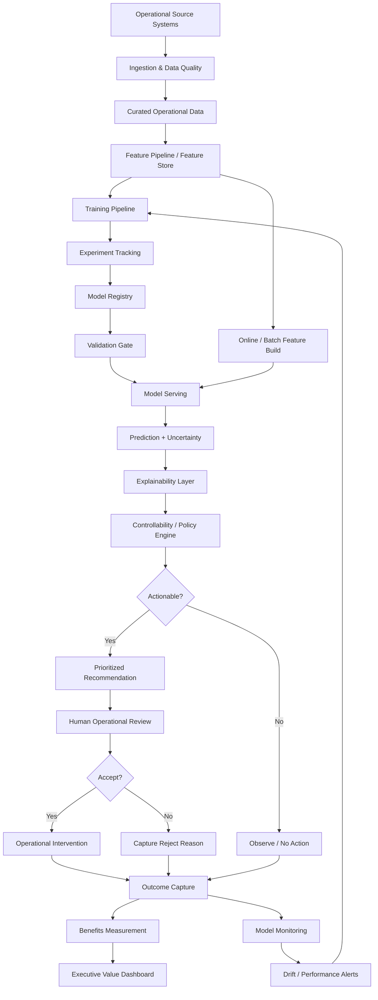

# Architecture Deep Dive

## Design objective

Build an AI decision-support capability that can identify fuel-efficiency opportunity, explain why it is being flagged, propose only feasible interventions, measure realized value, and remain governable as conditions change.

## Logical architecture



---

# Layer-by-layer design

## 1. Data layer

Sources may include:

- flight operations
- planning / dispatch
- aircraft / fleet
- airport operations
- weather
- ground operations
- fuel / engineering records

### Key controls

- point-in-time correctness
- data lineage
- schema validation
- missingness monitoring
- late-arriving data policy
- source ownership

---

## 2. Feature layer

The feature contract should explicitly state:

- feature definition
- source
- refresh frequency
- availability time
- owner
- training / serving transformation
- acceptable missingness

This prevents training-serving skew and data leakage.

---

## 3. Model lifecycle

```text
Experiment
→ validation
→ model registry
→ approval
→ deployment
→ monitoring
→ retraining / rollback
```

Production artifacts should include:

- model version
- training window
- feature version
- metrics
- segment performance
- model card
- approval record

---

## 4. Decision layer

This is deliberately separate from the model.

The model predicts **opportunity**.

The decision layer incorporates:

- controllability
- policy
- operational constraints
- value threshold
- confidence
- intervention capacity

This separation allows operations policy to change without unnecessary model retraining.

---

## 5. Human-in-the-loop

The user interface should show:

- predicted opportunity
- confidence
- top contributing factors
- controllable levers
- proposed action
- estimated value
- relevant context

The operator can:

- accept
- modify
- reject
- record reason

That feedback becomes part of the product-learning loop.

---

## 6. Monitoring

### Data
- missingness
- distribution shift
- schema change

### Model
- MAE / RMSE
- residual drift
- segment degradation
- confidence distribution

### Decision
- actionable rate
- acceptance rate
- override rate
- false-positive workload

### Value
- modeled opportunity
- acted opportunity
- realized savings
- benefit persistence

---

## 7. Deployment pattern

For many operational use cases, **batch or near-real-time scoring** may be more appropriate than low-latency online inference.

Architecture should be driven by decision timing, not by a desire to make the system "real time."

---

# Key trade-offs

## Accuracy vs interpretability
A modest model with clear operational logic may create more value than a marginally stronger black-box model.

## Model complexity vs maintainability
A complex ensemble may not justify itself if operations change frequently.

## Alert volume vs capture
Lower thresholds capture more opportunity but increase operator burden.

## Automation vs control
More autonomy can reduce friction but increases operational and governance risk.

## Central platform vs use-case-specific stack
Reusable capabilities create scale, but over-standardization can constrain use cases with different latency, risk, or data requirements.
